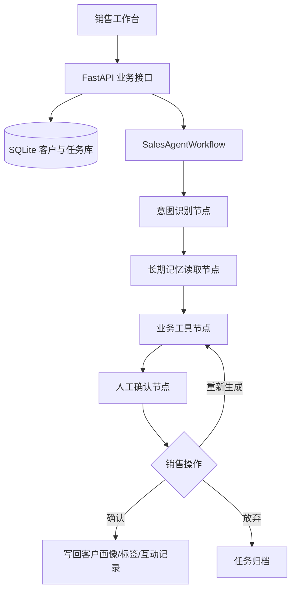

# Sagt 销售智能体工作台

Sagt 是一套面向零售与私域销售团队的 AI 销售赋能系统。系统围绕客户长期记忆、客户画像、自动标签、沟通建议、客服建议和日程建议构建完整业务闭环，帮助销售人员在跟进客户前快速理解客户偏好、消费能力、沟通风格和下一步动作。

项目可直接本地运行，内置可复用的初始化业务数据，便于快速启动和验证流程；同时提供客户新增、互动记录新增、客户档案导出、任务确认和重新生成等业务接口，方便对接 CRM、企业微信或销售管理后台。

## 核心能力

- 客户长期记忆：沉淀微信沟通、订单线索、售后反馈和销售确认结果。
- 客户画像生成：提取消费偏好、预算区间、家庭与社交场景、关键诉求和风险提醒。
- 自动标签：根据客户行为生成白酒偏好、商务宴请、交付敏感、定制服务等标签。
- 沟通建议：为销售生成可直接发送的聊天话术，并解释建议背后的销售意图。
- 服务建议：输出交付、物流、发票、定制样稿、售后回访等服务动作。
- 日程建议：根据客户最近意图生成跟进提醒，降低关键客户漏跟风险。
- 人机协同：AI 只生成建议，客户画像和关键建议需要销售确认后才会写入客户记忆。
- 数据接口：支持新增客户、新增互动记录、导出客户完整档案和任务记录。

## 技术架构



## 目录结构

```text
02-sagt-lite/
  backend/
    app/
      main.py          # FastAPI 接口与业务写入
      workflow.py      # 销售智能体工作流
      agent_tools.py   # 客户画像、标签、建议生成工具
      database.py      # SQLite 表结构与初始化业务数据
      config.py
    requirements.txt
  frontend/
    index.html
    assets/
      app.js
      styles.css
  scripts/
    smoke_test.py
```

## 快速启动

```bash
cd 02-sagt-lite
python -m venv .venv

# Windows
.venv\Scripts\activate

# macOS / Linux
source .venv/bin/activate

pip install -r backend/requirements.txt
uvicorn backend.app.main:app --reload --host 127.0.0.1 --port 8002
```

访问：

```text
http://127.0.0.1:8002
```

## 验证流程

```bash
python scripts/smoke_test.py
```

通过后会看到：

```text
Sagt 销售智能体健康检查通过。
```

## 主要接口

| 方法 | 路径 | 说明 |
| --- | --- | --- |
| GET | `/api/health` | 健康检查 |
| GET | `/api/customers` | 客户列表 |
| POST | `/api/customers` | 新增客户 |
| GET | `/api/customers/{id}` | 客户详情、互动记录和任务 |
| POST | `/api/customers/{id}/interactions` | 新增客户互动记录 |
| GET | `/api/customers/{id}/export` | 导出客户档案与任务记录 |
| POST | `/api/customers/{id}/tasks` | 执行智能体任务 |
| POST | `/api/tasks/{id}/action` | 确认、放弃或重新生成 |
| GET | `/api/tasks` | 最近任务 |

## 使用建议

1. 先从客户列表选择一个客户，查看长期记忆和历史互动。
2. 执行“客户画像”或“客户标签”，确认后结果会写回客户档案。
3. 执行“聊天建议”“客服建议”或“日程建议”，确认后建议会沉淀为新的互动记录。
4. 使用新增互动记录接口接入企业微信、客服系统或 CRM 事件。
5. 使用导出接口做销售主管复盘、客户交接或智能体记忆审计。

## 简历写法参考

Sagt 销售智能体工作台：基于 FastAPI 和 SQLite 构建销售智能体系统，围绕客户长期记忆、客户画像、自动标签、聊天建议、客服建议和日程建议实现完整业务闭环；设计多节点 Agent 工作流，支持意图识别、记忆读取、业务工具调用和人工确认，提供客户新增、互动记录写入、客户档案导出等业务接口，前端实现移动端销售工作台界面。
