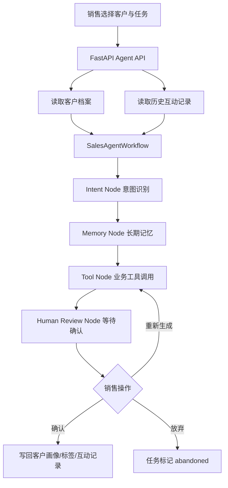

# Sagt Lite 企业销冠智能体

Sagt Lite 是一个面向实习作品集的销售智能体项目。它模拟零售企业销售助手场景，通过客户长期记忆、工具调用、任务状态流转和人机确认机制，完成客户画像、客户标签、聊天建议、客服建议、日程建议等业务动作。

项目默认不依赖外部大模型 Key，使用本地规则型 Agent 工具保证可以完整演示。后续可以把工具函数替换为 LangGraph 节点或 LLM Tool Calling，项目结构已经按工作流思想拆分。

## 项目亮点

- 内置客户数据、企业微信式互动记录和客户长期记忆。
- 提供客户画像、客户标签、聊天建议、客服建议、日程建议五类智能体任务。
- 每次任务都会经历“意图识别 -> 读取记忆 -> 调用工具 -> 等待人工确认”的工作流。
- 支持确认、放弃、重新生成，体现真实业务中的人机协同与安全控制。
- 确认客户画像和标签后会写回客户档案；确认建议类任务后会写入互动记录。
- 自带移动端风格 Web 界面，适合截图放入作品集。

## 技术架构



## 目录结构

```text
02-sagt-lite/
  backend/
    app/
      main.py          # FastAPI 接口
      workflow.py      # LangGraph-style 工作流
      agent_tools.py   # 客户画像、标签、建议等工具
      database.py      # SQLite 与演示数据
      config.py
    requirements.txt
  frontend/
    index.html
    assets/
      app.js
      styles.css
  scripts/
    smoke_test.py
```

## 快速启动

```bash
cd 02-sagt-lite
python -m venv .venv

# Windows
.venv\Scripts\activate

# macOS / Linux
source .venv/bin/activate

pip install -r backend/requirements.txt
uvicorn backend.app.main:app --reload --host 127.0.0.1 --port 8002
```

打开浏览器访问：

```text
http://127.0.0.1:8002
```

## 冒烟测试

```bash
python scripts/smoke_test.py
```

通过后会看到：

```text
Sagt Lite smoke test passed.
```

## 演示流程

1. 选择客户“程哥”。
2. 点击“客户画像”，查看 Agent 生成的画像。
3. 点击“确认”，画像会写回客户档案。
4. 点击“客户标签”，再点击“重新生成”，查看不同版本标签。
5. 点击“聊天建议”或“客服建议”，确认后建议会沉淀到客户长期记忆。

## API 简表

| 方法 | 路径 | 说明 |
| --- | --- | --- |
| GET | `/api/health` | 健康检查 |
| GET | `/api/customers` | 客户列表 |
| GET | `/api/customers/{id}` | 客户详情、互动记录和任务 |
| POST | `/api/customers/{id}/tasks` | 执行智能体任务 |
| POST | `/api/tasks/{id}/action` | 确认、放弃或重新生成 |
| GET | `/api/tasks` | 最近任务 |

## 简历写法参考

Sagt Lite 企业销冠智能体：基于 FastAPI 和 SQLite 实现销售智能体系统，构建客户长期记忆、客户画像、自动标签、聊天建议、客服建议和日程建议等业务工具；设计类 LangGraph 的多节点工作流，支持意图识别、记忆读取、工具调用和人工确认，前端提供移动端风格交互界面，完整展示 AI 辅助销售、人机协同和客户数据沉淀流程。
